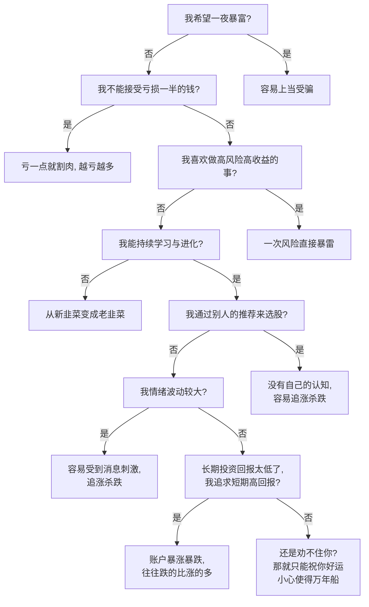

---

所谓的新手，和炒股时间无关，一个股民就算炒了很多年的股票，但是没有形成自己的交易系统且认知没有提升，那他也只能够算是新手

温馨提示：股市有风险，投资需谨慎

一、炒股炒的是信息查

二、市场是公平的，但又是不公平的

二、不能完全依赖技术分析，要结合消息面

三、不要迷信任何网上教人炒股的课程，他要是那么厉害他早就炒股赚钱去了，何必在这的给你卖课。他教你的唯一理由就是挣你的钱。懂得内幕的人不能说真话，因为签了保密协议，说能够预测市场趋势的人都是猜的。

# 什么是股票？了解基本游戏规则

炒股和游戏很像，或者说炒股本身就是一种资本游戏。要玩好这个游戏，首先要了解游戏规则（有哪些玩家？他们对游戏的局面影响的大小？我处于什么位置？）；其次要先照猫画虎学会一些基本的打法；然后在游戏的不同阶段要根据实际情况调整自己的对策；最后要通过实战来不断地试错、改正、提升，最终形成自己独立的且具有特色的能够保证高胜率的打法。

## 一些基本知识

什么是股票

股票是市场经济中重要的组成部分，又称为经济的晴雨表。发行股票的目的是为了帮助企业融资，从而加快市场的发展。

股票涨跌机制

股票的价格等于最近一次成交的价格，

价格不等于价值，

什么是炒股

做多 vs 做空

A股为了保证市场稳定，不允许做空

T+1，这里的T就是时间，+1表示该交易日买的股票，最早在下一个交易日才能卖出。这个交易日卖出的股票，最早到下一个交易日才能兑现。T+1的存在有利于维护市场的稳定性。

一只股票中有哪些玩家，他们的筹码分别是多少，谁能大幅影响股票价格

散户

主力

公募

私募

游资

# 长线投资 vs 短线投机

后者通过低吸高抛转差价，本质上赚的是其他散户的钱；前者通过长期价值投资，赚的是企业增长带来的收益，对企业、其他散户都是有利的

## 资金分配

A股市场只有5%的公司是有价值的，其他公司只能炒热点。

散户应该采用二八原则，将大部分资金用于长期价值投资，少部分资金由于炒热点投机。既能保证大部分资金安全，又能够保证转却超额收益。

## 一招鲜吃遍天

长线投资看股息率，短线投资看胜率

# 长线投资

长线投资的核心就是巴菲特的价值投资理论，即寻找优质的资产，在价格被低估的时候入场，长期持有。当资产被严重高估的时候，同时市场普遍看好的时候卖出。

总结，买在无人问津时，卖在人声鼎沸处。

寻找优质资产->基本面分析

入场时机->技术分析

## 基本面分析

### 寻找优质资产

稀缺性，每个市场都有它特殊存在的优质行业，对于A股市场，最优质的行业就是白酒，同时白酒也是全球只有A股上市的行业，可见稀缺性，而中国最好的科技股都在港股

经营能力，长期投资公司相当于做公司的股东，将钱借给公司，公司通过分红给股东回报，同时股东可以享受公司成长带来的收益。因此一个公司的经营能力十分重要，高端白酒作为垄断企业，具有独特的地位，同时具有将近90%的超高毛利率，这些特点保证了它具有永续经营的能力。股息率是经营能力的直接体现，上市公司其他的数据可以造假，但是因为分红是公司真金白银分给股东的，无法造假，白酒常年保持着5%左右的股息率，因此是优质资产

同理分析银行，作为背靠国家的机构，具有永续经营的能力，人民把钱存到银行，银行拿钱去放贷款，盈利模式简直是无敌的存在，而且股息率常年保持在5%左右，因此是优质资产。

### 整体局势分析

当前全球的股市都处于高位，只有中国资产还处在低位。美国通货膨胀居高不下，美联储迟早会降息从而抑制通胀，那时资金便会逃离美国，寻找更好的投资机会，纵观全球只有中国有这么大的体量同时又被严重低估，前段时间中国也在频繁“秀肌肉”，外资也在唱多中国市场，因此外资必然会涌入中国市场。而外部因素的涌入必然打破原有的平衡，带来一波牛市。

关键指标，美联储降息，RMB升值

## 技术面分析

即使是优质资产，也要买在价格低的时候。

利用量价关系和双金叉可以判断当前该资产处于哪个阶段。

### 量价关系

成交量是大海里的水，股价是大海里的小船，先有成交量才能把价格往上推升。

通过量价关系可以找出顶背离或者底背离，用于判断顶部和底部。

地量见低价，天量见天价。

### MACD金叉 vs 均线金叉

双金叉意味着这一个下跌波段的结束，双死叉意味着这个上涨波段的结束。

涨势末期不买，跌势末期不卖。

# 短线投机

大涨才能弥补小亏

## 如何操盘

首先要学会判断市场处于什么时期，一般分为三种情况，上涨、下跌、震荡。不同时期操盘的策略有所不同。

在上涨时期，要尽可能选择人气高的股票，所谓的人气高，就是不断的有增量资金流入，尽可能多的选择这样的标的，增量资金的流入会增加人气，人气会带来更多增量资金，进而股价上涨。

下跌阶段，尽量少操作、或者空仓，唯一做法是超跌反弹，找到一个市场的情绪崩溃点，在超跌大盘的时候，找到超跌板块的超跌个股，快进快出做套利，就算不赚钱也要走，因为中期来看还是下跌趋势。

震荡时期，少量建仓试错，等到突破加仓。

一开始酝酿，一小部分人开始赚钱，吸引更多人的加入，或者原来的玩家加仓，从而强化上涨，加速上涨，然后会演变为一种疯狂，大家都没有风险意识，最后在高位发生分歧，放量滞涨，这时候要果断立场

最重要的是胜率。

### 技术面分析

历史总是惊人的相似，却不是简单的重复。所谓的技术分析，就是前人研究股市的历史数据总结出来的规律，用于判读股市后市的趋势。也有一个说法是这些技术指标是经济学家故意搞出来糊弄韭菜股民的。无论相信哪种说法，都需要资金亲自去验证。

注意技术分析是有局限性的，他成立的前提是市场本身是稳定的，基本面没有太大的改变且情绪的影响不大。一旦外部因素发生了重大改变，将会导致技术分析临时失效。

#### MA均线

#### 量价关系

#### MACD

#### 筹码分布及获利盘

### 消息面（市场情绪）分析

有很多时候你会发现，光靠技术分析有时候无法预测一致股票的趋势，甚至完全相反。这是因为技术分析的前提是股票的模型变化不大，但是外部因素的介入会直接改变股票的模型，导致技术分析暂时失效。例如当市场上出现重大利好时，由于人性的本质是贪婪的，大家都会争相购买，导致股价进一步升高，跳出了原来的模型

#### 国家政策

A股市场自诞生以来就自带依赖国家政策的属性，因此关注国家发布的消息可以帮助判断走势，一些网站可以获取最新消息：

中央政府网站

地方政府网站

#### 行业利好

新概念、新技术（AI）

#### 企业应收

企业年报

#### 宏观（国家政策层面）

#### 中观（行业发展层面政策和景气度）

#### 微观（股票基本面，主要是各项财务指标）

## 心法

别人贪婪时我更贪婪，别人恐慌时我更恐慌

胜率小于60%，空仓

胜率大于60%，轻仓

胜率大于75%，半仓

胜率大于90%，满仓

至少经历过一次完整的牛熊，从中总结

520战法

收复5日线，建仓

站上20日线，加仓

跌破20日线，清仓

趋势才是王道

如何找买点

如何找卖点

控制风险

炒股终极境界：知行合一

## 如何看懂龙虎榜

炒股炒的就是信息差，由于证券交易所公布的信息非常有限，如何利用这些信息来调整自己的战法显得尤为重要。

散户的最佳玩法就是跟随大玩家。（大猪小猪理论）

一个股票的走势往往由大玩家决定，这里的大玩家指的是机构、游资，他们的特点是资金体量大，这意味着他们能够形成足够强的合力，推动股价的走势。

机构指的是证券自营基金、社保基金、公募基金、私募基金、银行资金、保险资金、企业年金、信托、QFII等，他们是主力，能够控制股价的走势

游资指的是拥有大量资金（通常在亿级别，但是体量比机构小）的个人投资者，他们通常炒作题材，往往是快进快出

大户指的是拥有一般大体量的资金（通常在百万级别），他们有很强的投资逻辑，但是投机能力较差

散户，整天追涨杀跌，是机构和游资收割的对象，俗称韭菜

龙虎榜是每天交易所官方公布的真实的有异动的股票的买卖情况，是散户唯一能够窥视大玩家行为的窗口

[股票干货：最全龙虎榜教学详解、游资席位大全（建议收藏） - 知乎](https://zhuanlan.zhihu.com/p/337131490)

## 从主观投资到量化投资

参考[一名程序员眼里中国量化投资的未来 作者：梁文锋（幻方量化） 来源：公众号“橙小巫”首先，预测中国量化投资的未来，一个办法就是看一下美国老师的现状。美国的资... - 雪球](https://xueqiu.com/3619239198/132180425)

[LHospitalLKY/JointQuant_Learning: 聚宽网量化投资策略编写的学习文档](https://github.com/LHospitalLKY/JointQuant_Learning/tree/master)

传统的主观投资需要人为进行决策，而人类往往容易受到情绪左右，导致无法做出最优决策。采用人工智能来进行决策可以规避由于人类不理智带来的风险。

## 近期市场看法

### 2025年3月10日：

个人觉得，3月份没啥盼头，别追涨。春节这一波行情主要是因为港股科技类被低估，外资进入港股，重新进行估值修复，目前已经修复到合理区间，近期不会有更多的资金流入，要进行整理了。另一方面，两会前的股市有政策要求进行维稳，可以看到指数走得非常稳定，现在两会即将结束，预期都兑现了，资金要借利好出货，没有了大资金流入就不可能出现大涨。因此大盘最好的走势就是横盘震荡。横盘震荡期间，就会出现板块轮动，高位的股估计要出现回调，低位的股已经陆续开始补涨。总体来说，未来的大行情主要还要看外资的态度，等待美联储降息，RMB升值，资金要寻找更高回报的渠道，而如今美、欧洲、日本、印度的资产都已经严重高估，而目前具有这么大体量的市场就只有中国市场，因此到那时外资就会开始购买中国资产，那才是真正的牛市。

为什么每一次大牛市都是由外资推动的呢？或者说国内资本对A股没有定价权（A股打了20年的3000点保卫战，看看人家美股涨了多少倍），先说体量，A股的体量大概是13万亿美元，而光贝莱德一家机构的体量就有11万亿美元，可见外资在A股中的重要性；再说A股的政策原因，多年前管理层对A股是重融资请投资的态度，企业上市就是为了套现割韭菜，每次IPO都是在市场情绪慢慢起来的时候去发行包括本轮的蜜雪冰城，还有这个月新股达到5只（其中的逻辑是管理层认为市场已经回暖了，可以慢慢抽点血了），没有一个合理的退市机制去淘汰垃圾公司。

关于股票品种布局，个人认为近期需要投资一些低估值股票。例如白酒，特别是高端白酒，白酒行业是A股中最具有价值的投资标的。当前国家经济疲乏，经济的三驾马车，投资、出口、消费，前有资产负债问题，后有国际形势紧张，宏观调控者能做的就是刺激消费。在过去，老百姓的金融资产大部分放在了楼市中，而随着楼市崩盘，市场上需要更大的蓄水池，这个就是股市。首先，高端白酒是消费中的特殊存在，电子消费品有时效性，例如手机现在卖4000块，一年之后可能就打五折了，但是白酒不一样，卖不出去可以存着，而且存越久越贵。其次，白酒行业具有高达90%的毛利率，科技类公司大多数不到30%，作为如此赚钱的公司，不需要担心其财务状况。然后，白酒的分红达到了4-5%，如果说所有的指标都可以账面造假，但是唯有股息率这个是没法造假的，因为这是公司真金白银拿出来分给投资者的钱。最后，白酒目前的价位属于低估位置，在这个位置买入风险不会特别大。

# 一些题外话

## 3000点保卫战

翻看过去20年的历史，发现A股一直在3000点左右徘徊，一旦上涨到3400点，管理层便开放IPO，来市场中吸血，给市场降温，一旦跌倒2600点，国家队又会出手救市。

## 炒什么币

为什么会有比特币，因为市场需要更大的蓄水池，来容纳这些资金

# 参考

[炒股十大境界 - 知乎](https://zhuanlan.zhihu.com/p/404782480)

[主力庄家最怕的是什么？ 我曾在机构操盘6年，作为曾今的镰刀手，我告诉你这背后的真正原因。有一种股民，让主力都很无奈。理论上，主力是不害怕任何散户... - 雪球](https://xueqiu.com/7204043901/305445773)

[顶级游资的逆袭之路——“炒股养家”，从10万到10亿的独到心法 -红与绿，让投资多姿多彩- 添加⭐️标 不再错过推送 红与绿导读： 大局观是一种感觉，或许有时候不明白，但是尽量多尝试让... - 雪球](https://xueqiu.com/8680038754/310553552)

[真正的王者指标：“筹码分布”，只需看一眼就知道主力洗盘还是出货 - 知乎](https://zhuanlan.zhihu.com/p/265039359)

[实战筹码系列：看懂筹码分布，识别主力意图_哔哩哔哩_bilibili](https://www.bilibili.com/video/BV1MP411y7oR/?spm_id_from=333.337.search-card.all.click&vd_source=db16ac2ca7431d88dfb44ce1b7371f5a)

[到底是创业还是炒股_哔哩哔哩_bilibili](https://www.bilibili.com/video/BV1RDrVY6EJX/?spm_id_from=333.1007.tianma.1-1-1.click&vd_source=db16ac2ca7431d88dfb44ce1b7371f5a)

[炒股一旦开了窍，人生就像开了挂！炒股15年，用100万买了这7句话，字字珠玑，建议收藏！_哔哩哔哩_bilibili](https://www.bilibili.com/video/BV1wXrHYGEDW/?spm_id_from=333.1007.tianma.11-2-40.click&vd_source=db16ac2ca7431d88dfb44ce1b7371f5a)

[全球第一博客 — 缠中说禅](https://chzhshch.blog/)

[一名程序员眼里中国量化投资的未来 作者：梁文锋（幻方量化） 来源：公众号“橙小巫”首先，预测中国量化投资的未来，一个办法就是看一下美国老师的现状。美国的资... - 雪球](https://xueqiu.com/3619239198/132180425)

[LHospitalLKY/JointQuant_Learning: 聚宽网量化投资策略编写的学习文档](https://github.com/LHospitalLKY/JointQuant_Learning/tree/master)

[股票干货：最全龙虎榜教学详解、游资席位大全（建议收藏） - 知乎](https://zhuanlan.zhihu.com/p/337131490)

[庄家，机构，游资，大户，散户的关系 - 知乎](https://zhuanlan.zhihu.com/p/380207074)

[A股12大顶级游资及其席位介绍，第一名当之无愧是徐翔总舵主！ 股市里的知名游资，是一群胆大并技艺高超的投资者，他们时常隐匿在龙虎榜游资席位之中，操盘风格彪悍，手法诡异，善造妖股。他们... - 雪球](https://xueqiu.com/3015603135/151415645)

[2024顶级游资席位最全名单一览表_游资大佬及席位大全（全网最全） - 知乎](https://zhuanlan.zhihu.com/p/605842311)
